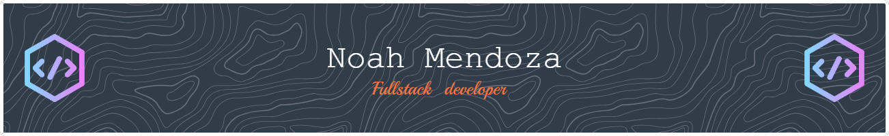

Hi I'm Noah!
I’m a current General Assembly student projected to graduate in October with a Computer Science degree in progress as well! I love a good challenge and finding creative approaches to problem solving and using the skills I picked up from my Naval Medicine background to find those creative answers. I love a collaborative team environment where I can learn from my peers and add to my existing leadership skills by working under an inspiring leader. Reach me at my socials below :) 

<!--
**noahD0zer/noahD0zer** is a ✨ _special_ ✨ repository because its `README.md` (this file) appears on your GitHub profile.

Here are some ideas to get you started:

- 🔭 I’m currently working on ...
- 🌱 I’m currently learning ...
- 👯 I’m looking to collaborate on ...
- 🤔 I’m looking for help with ...
- 💬 Ask me about ...
- 📫 How to reach me: ...
- 😄 Pronouns: ...
- ⚡ Fun fact: ...
-->

